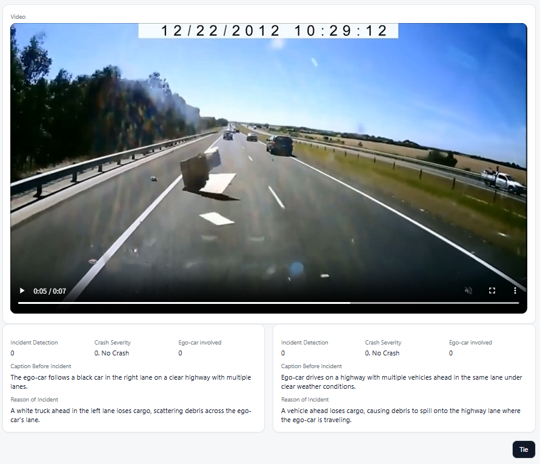
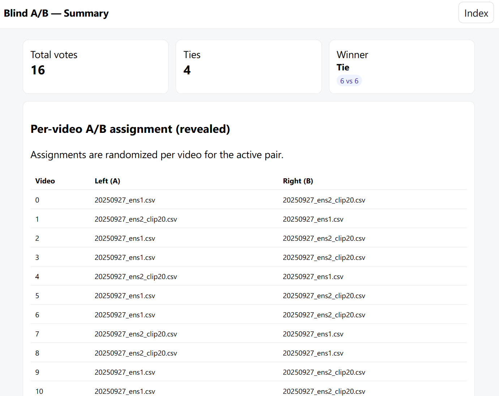

# 2COOOL Studio

A lightweight Flask web app for **blind A/B evaluation** of caption/reason outputs from the [Kaggle 2COOOL competition](https://www.kaggle.com/competitions/2coool/overview).  
It displays a video alongside two CSV-derived descriptions and lets you vote which one is better—directly in the browser.



## Features

- Pick **any two** CSVs under `csv/` to compare.
- Uses videos from `data/` (`.mp4` files).
- **Blind evaluation:** the A/B assignment is randomized per video; left/right is randomized as well.
- Per-video page:
  - Click the **left** or **right** card to cast a vote.
  - Use the **Tie** button to mark a draw.
  - Videos auto-play when you navigate.
- Results are saved to `results/<pair-specific-dir>/votes.csv`.
- **Summary** page:
  - Shows win/tie counts.
  - Shows the A/B ↔ CSV mapping for each video.
  - Lets you download `votes.csv`.



## Directory Structure

Prepare `csv/` and `data/` as below and place your files accordingly.  
You **don’t** need all 661 videos under `data/`; any subset is fine.

```

006_2coool-studio/
├─ app.py              # Flask application
├─ csv/                # CSVs to compare (place ≥ 2 files)
├─ data/               # Video files (*.mp4)
└─ results/            # Generated evaluation results

````

## Getting Started

### Environment

```bash
python3 -m venv .env
source .env/bin/activate
pip install flask
````

> Requires Python 3.9+ and [Flask](https://flask.palletsprojects.com/).

### Make Videos Browser-Friendly (H.264 + AAC)

The original competition videos are encoded as MPEG-4 Simple Profile and may not play in modern browsers (e.g., Chrome).
Convert videos in `data/` to **H.264 + AAC (MP4)** before use.

> ⚠️ **This will overwrite files in `data/`.** Back up if needed.

```bash
for f in data/*.mp4; do
  ffmpeg -y -i "$f" \
    -map 0:v:0 -map 0:a? \
    -c:v libx264 -preset veryfast -crf 23 -pix_fmt yuv420p \
    -c:a aac -b:a 128k \
    -movflags +faststart \
    "${f%.mp4}.tmp.mp4" && mv "${f%.mp4}.tmp.mp4" "$f"
done
```

(Original files are shared by the organizers; ensure you have access and permission to use them.)

### Run the App

```bash
python app.py
```

On startup you’ll see paths and URLs like:

```
 * CSV_DIR=/abs/path/to/006_2coool-studio/csv
 * DATA_DIR=/abs/path/to/006_2coool-studio/data
 * RESULTS_DIR=/abs/path/to/006_2coool-studio/results
 * Access from Windows: http://localhost:8000
 * Running on http://127.0.0.1:8000
 * Running on http://<your-ip>:8000
```

Open **[http://localhost:8000](http://localhost:8000)** in your browser.
For WSL2, use the printed IP (e.g., `http://172.20.xx.xx:8000`).
Press **Ctrl+C** to stop the server.

## Usage Tips

* Put at least **two** CSVs under `csv/` and your videos under `data/`.
* From the index page, select two CSVs to start a blind A/B session.
* Cast votes by clicking on the left/right card; select **Tie** when appropriate.
* Open the **Summary** page to review totals, see the A/B mapping, and download `votes.csv`.

## Notes

* The built-in Flask dev server is for local use only. For production, deploy behind a proper WSGI server.
* Follow the dataset license and competition rules when sharing videos or CSVs publicly.

## Acknowledgments

* Kaggle 2COOOL competition community
* Flask maintainers
